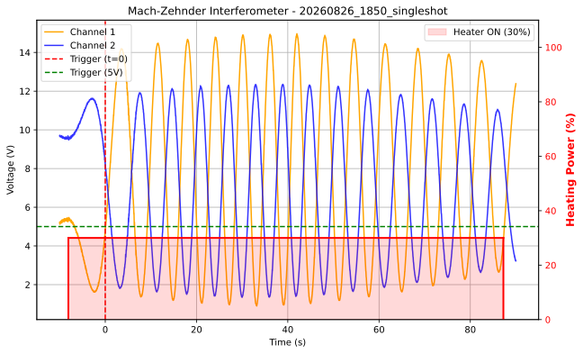
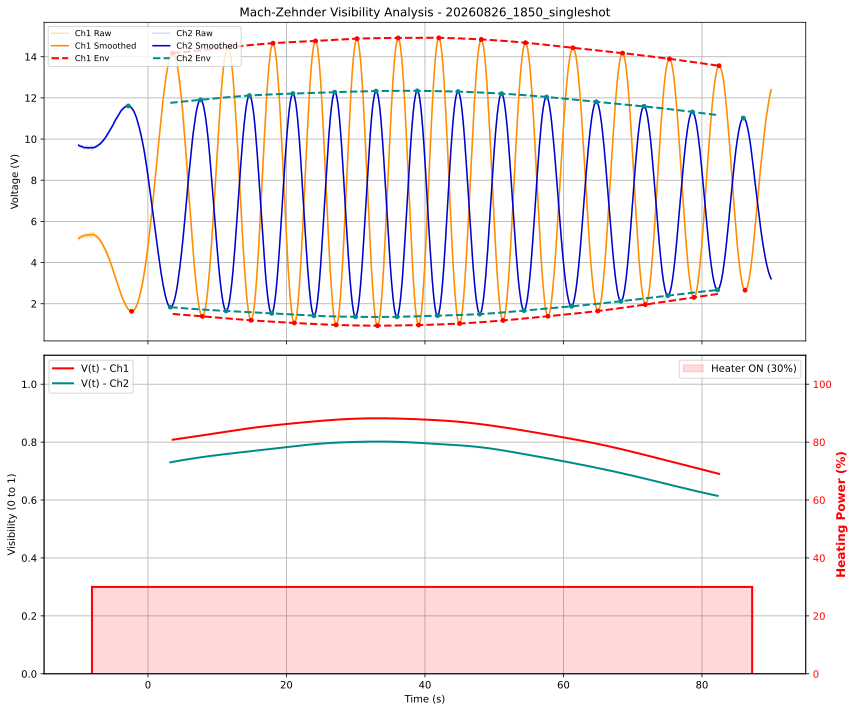

# 3D-printed Mach-Zehnder interferometer


A desktop-sized Mach-Zehnder interferometer — mirrors, beamsplitters, and every mount that holds them — 3D-printed to demonstrate wave interference. Fringe intensity is acquired via OPT101 photodiodes and a Siglent SDS824XHD oscilloscope, with a thermally induced phase shift driven by a Kapton heater.

Still very much a work in progress.




## Repository layout

```
singleshot/     acquisition, control and analysis scripts for single-shot measurements
continuous/     continuous fringe acquisition from the oscilloscope
```

## License

Licensed under the [GNU GPLv3](LICENSE).
