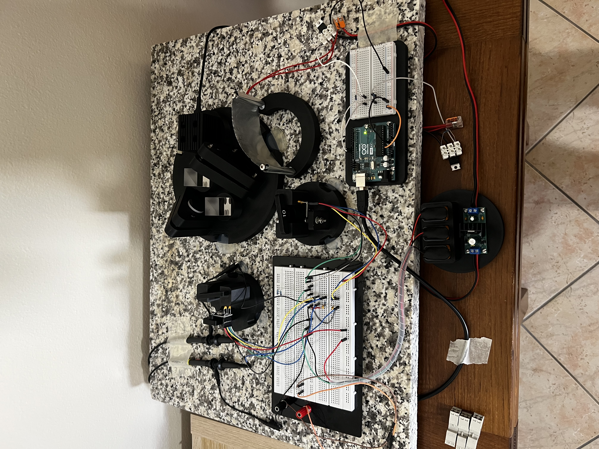

# 3D-printed Mach-Zehnder interferometer



Design, construction and optical alignment of a desktop-sized, 3D-printed Mach-Zehnder interferometer to demonstrate wave interference. Fringe intensity is acquired via OPT101 photodiodes and a Siglent SDS824XHD oscilloscope, with a thermally induced phase shift driven by a Kapton heater.

Still very much a work in progress.

## Repository layout

```
singleshot/     acquisition, control and analysis scripts for single-shot measurements
continuous/     continuous fringe acquisition from the oscilloscope
```

## License

Licensed under the [GNU GPLv3](LICENSE).
